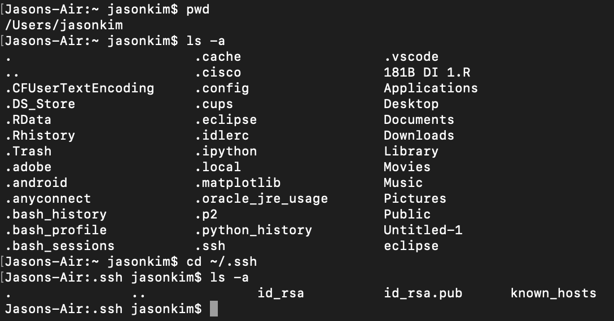

# **Lab Report 2**
Jason Kim, A16953241

In this week's lab, I created a web server called `ChatServer` that allows users to input new chat messages and stores the entire chatlog for that session. In lab, I also explored setting up SSH keys for faster logging in onto `ieng6`.

## Part 1: `ChatServer`

Based on the skeleton code provided by the `wavelet` directory and `NumberServer` we explored in Week 2's lab, I created a new web server called `ChatServer` with the following code:

```
import java.io.IOException;
import java.net.URI;

class Handler implements URLHandler {
    // The one bit of state on the server: a String that will be updated
    // as new chat messages are added.
    String chat = "";

    public String handleRequest(URI url) {
        if (url.getPath().contains("/add-message")) {
            String[] parameters = url.getQuery().split("[&=]");
            String username = parameters[3];
            String user_message = parameters[1];                                                                                        
            chat = chat + username + ": " + user_message + "\n";
            return chat;
        }
        return "To begin chatting, append the URL with: /add-message?s=<string>&user=<string>";
    }
}

class ChatServer {
    public static void main(String[] args) throws IOException {
        if(args.length == 0){
            System.out.println("Missing port number! Try any number between 1024 to 49151");
            return;
        }

        int port = Integer.parseInt(args[0]);

        Server.start(port, new Handler());
    }
}
```

In the above code, we take the query portion of the URL and separate it into Strings that we can concatenate to form a chat message.
Then we concatenate the new chat message with a String containing all of the previous chat messages (our chatlog).

Adding Message 1
---
We added a message to our chatlog using the following path: `/add-message?s=hello%20world!&user=jason`. As we can see from the screenshot below, we got the message to display as expected.


In this usage of `/add-message`, we called the following methods:
1. `.getPath()`: Calling this method on `url` (which is a `URI`) returns the path of the `URI` as a `String`. Our `URI` was `http://localhost:4000/add-message?s=hello%20world!&user=jason`, so this method returned only the path: `/add-message?s=hello%20world!&user=jason`.
2. `.contains()`: We called this method on the `String` path of the `URI` with `/add-message` as a `String` argument to check if the argument is a substring of the path. Since `/add-message` is a substring of the path, the method returns true for the conditional statement.
3. `.getQuery()`: Calling this method on `url` returns the query portion of the `URI` as a `String`. Our  `URI` was `http://localhost:4000/add-message?s=hello%20world!&user=jason`, so this method returned only the query: `s=hello%20world!&user=jason`.
4. `.split()`: We called this method on the `String` query of the `URI` with `"[&=]"` as the argument. These are the two delimiters that allow us to separate the `String` into multiple `Strings` that we store in a `String` array named `parameters`. Our `String` array now has four `String` elements: `"s"` at index 0, `"hello%20world!"` at index 1, `"user"` at index 2, and `"jason"` at index 3. Then we created two new local `String` variables, `username` and `user_message`, and assigned them with `"jason"` and `"hello%20world!"` respectively.

Now we have all of our methods called and variables assigned values. We also have an empty `String` `chat` that was initialized at the very beginning. We update this `String` with a concatenation of the previous `chat` value, our `username` variable, a `String` `": "`, our `user_message` variable, and a new line denoted by `"\n"`. The new value of `chat` is: `"jason: hello world! \n"`, and `chat` is the variable that stores our chatlog as follows:
```
jason: hello world!
```
Note that in Safari (the browser I used), the `"%20"` in the `URI` is interpreted as a space for the query. As a result, the `String` `"hello%20world!"` becomes `"hello world!"` in the chatlog shown to the user.
Also note that `chat` is a global variable in the `Handler` class, so after the method is called, the value of `chat`, which includes the chatlog of previous messages, is not reset or removed.


Adding Message 2
---
We added another message to our chatlog using the following path: `/add-message?s=hello%20world%20again!&user=jason2`. We adjusted both the user portion and the message portion of the query. As we can see from the screenshot below, we got the message to display as expected.


In this usage of `/add-message`, we called the following methods (the same methods called when adding the first message!):
1. `.getPath()`: Calling this method on `url` (which is a `URI`) returns the path of the `URI` as a `String`. Our `URI` was `http://localhost:4000/add-message?s=hello%20world%20again!&user=jason2`, so this method returned only the path: `/add-message?s=hello%20world%20again!&user=jason2`.
2. `.contains()`: We called this method on the `String` path of the `URI` with `/add-message` as a `String` argument to check if the argument is a substring of the path. Since `/add-message` is a substring of the path, the method returns true for the conditional statement.
3. `.getQuery()`: Calling this method on `url` returns the query portion of the `URI` as a `String`. Our  `URI` was `http://localhost:4000/add-message?s=hello%20world%20again!&user=jason2`, so this method returned only the query: `s=hello%20world%20again!&user=jason2`.
4. `.split()`: We called this method on the `String` query of the `URI` with `"[&=]"` as the argument. These are the two delimiters that allow us to separate the `String` into multiple `Strings` that we store in a `String` array named `parameters`. Our `String` array now has four `String` elements: `"s"` at index 0, `"hello%20world%20again!"` at index 1, `"user"` at index 2, and `"jason2"` at index 3. Then we created two new local `String` variables, `username` and `user_message`, and assigned them with `"jason2"` and `"hello%20world%20again!"` respectively.

Now we have all of our methods called and variables assigned values. We also have a `String` variable `chat` that is the previous chatlog, and currently has the `String` value: `"jason: hello world! \n"`. We update this `String` with a concatenation of the previous `chat` value, our `username` variable, a `String` `": "`, our `user_message` variable, and a new line denoted by `"\n"`. This results in the new value of `chat`, which is `"jason: hello world!\njason2: hello world again!\n"`, storing our entire chatlog in one `String`. The `String` when printed looks like (as shown in the image):
```
jason: hello world!
jason2: hello world again!
```
In this request, the `username` and `user` variables were changed from the different query and thus updated accordingly. In addition, the `chat` variable was updated with the new chat message from this request while keeping the old message as well, concatenating them into one very long `String`.


## Part 2: SSH Keys

Logging In Without Password
---
After going through the steps in the Week 3 Lab instructions, I was successfully able to log into the `ieng6` computers remotely with `ssh` without having to input my login credentials, as shown in the screenshot below. The command I used to remotely access was `ssh jak019@ieng6.ucsd.edu`, and I didn't have to input anything after that single command.


Private Key Path
---
First, I checked my current working directory, then used the `ls -a` command to show all folders (including hidden folders starting with .). From this directory I used `cd` to change directory into the `/Users/jasonkim/.ssh` directory, where I used `ls -a` to find the `id_rsa` file, which holds the private SSH key on my personal computer.
Thus, the absolute path to the private SSH key is: `/Users/jasonkim/.ssh/id_rsa`



Public Key Path
---
First, 


## Part 3: New Insights
