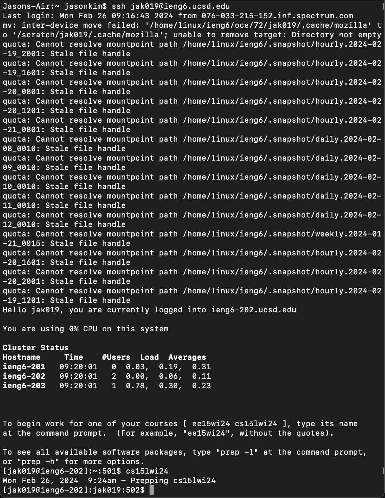
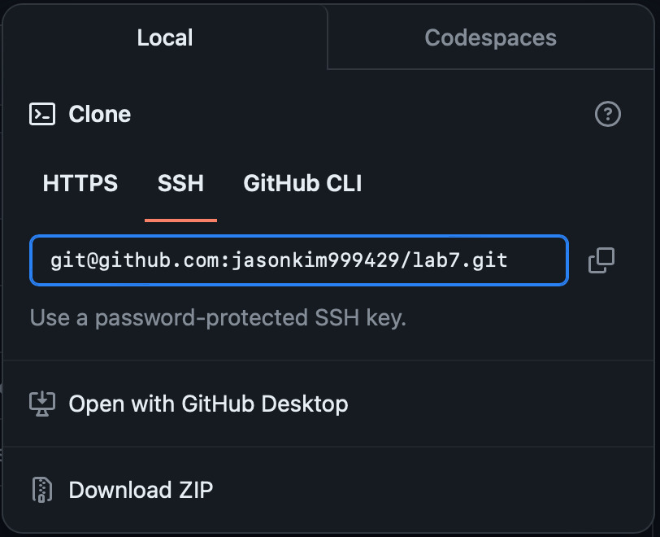
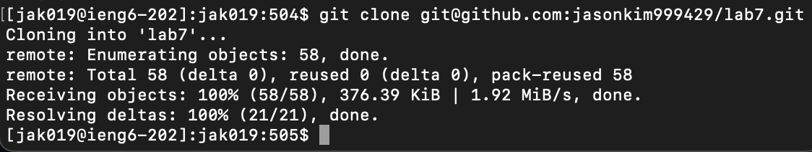
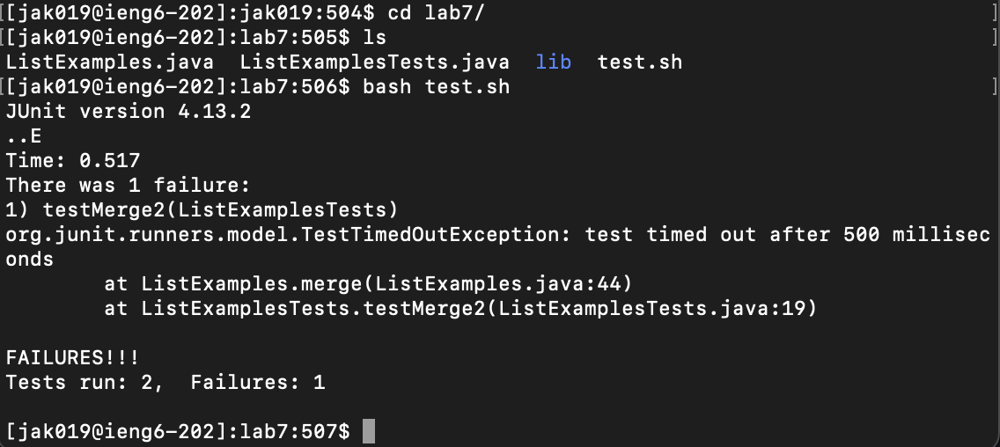
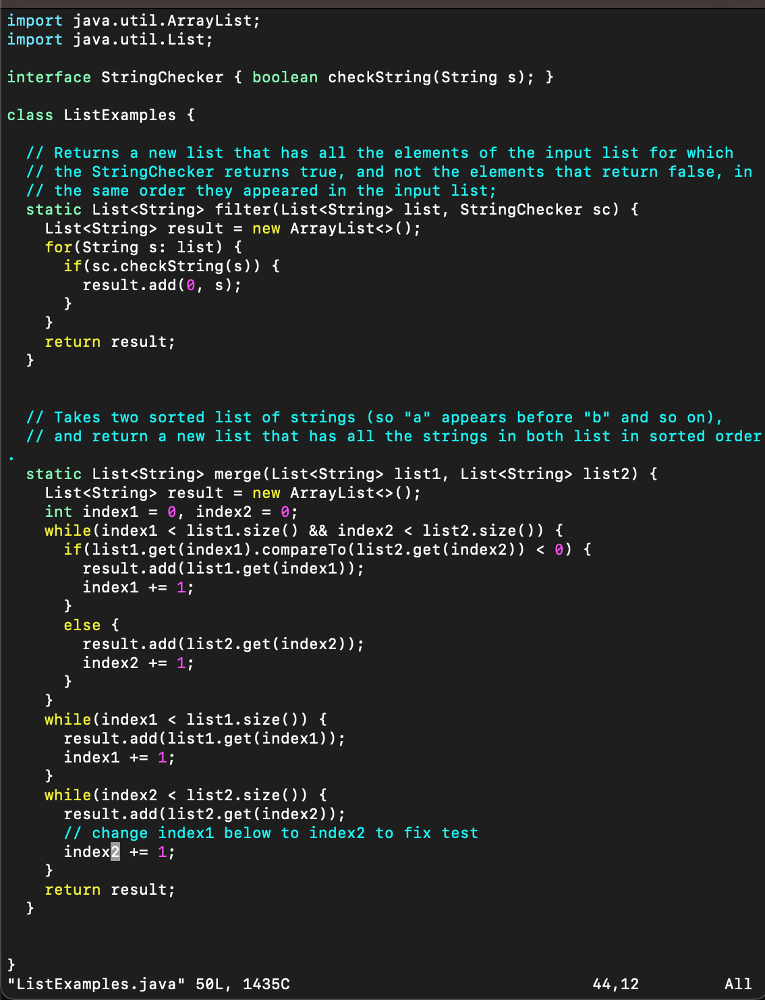
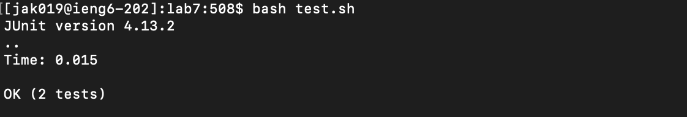
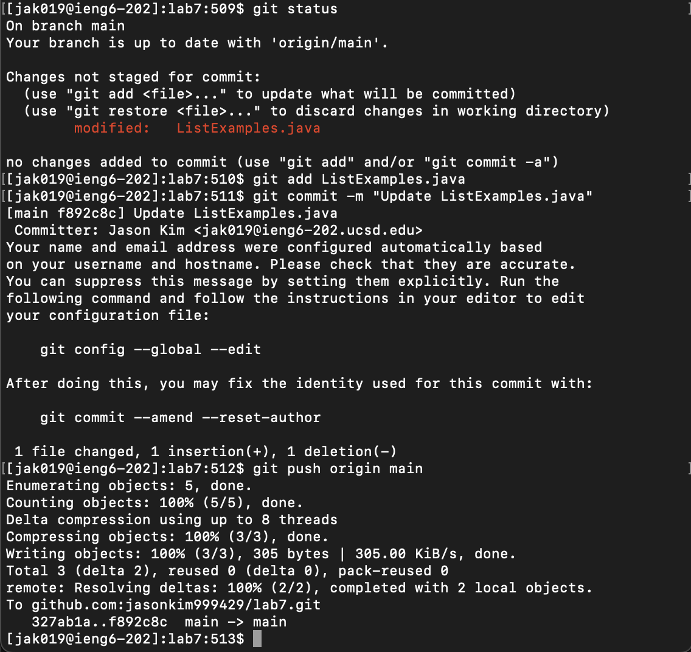

# **Lab Report 4**
Jason Kim, A16953241

In this week's lab, we got more comfortable using only the command line to navigate through directories, use git to clone, commit, and push to repos, and use Vim to edit files. In this lab report, we will be noting the shortcuts and steps that we took in our time trial to get faster and more efficient results.

## Time Trials
As part of the setup process, before starting the clock we deleted all practice forks created during the lab and forked the provided repository again for a fresh start. (Steps 1-3)

Step 4: Logging into `ieng6`
---
First, to log into the `ieng6` machines, we typed out the command `ssh jak019@ieng6.ucsd.edu<Enter>` in our terminal to `ssh` in remotely.
We want to clone our fork in our workspace for this class, so we typed `cs15<Tab><Enter>`, where the `<tab>` autocompletes our desired command to open our environment.
We are now ready to clone our fork!

Step 5: Cloning the fork (using SSH)
---
Before cloning the fork, on the Github page of the fork itself we copied the SSH link to our clipboard for easy access by clicking on the clipboard icon next to the link, as shown below.

Going back to the terminal, we typed `git clone <Command + V><Enter>` to paste the SSH link stored in our clipboard directly. 

Step 6: Running tests
---
We first start by `cd`ing into the `lab7` directory: we typed `cd l<Tab><Enter>` to autocomplete our desired path. Then we typed `ls<Enter>` to see the available files.
From the previous tests, we knew that the `test.sh` script provided ran the `javac` and `java` commands with the appropriate arguments, so we typed `bash t<Tab><Enter>` to autocomplete, as the `test.sh` script was the only file that started with a 't' in the `lab7` directory.
As we can see below, there is one test that failed: the `testMerge2` test method.

Step 7: Editing the code (using Vim)
---
In order to fix the method implementation, we have to open up the `ListExamples.java` file with Vim. We achieved this by using the command `vim L<Tab>.<Tab><Enter>`. Since there are two files (`ListExamples.java` and `ListExamplesTests.java`) in the directory, with `<Tab>` the terminal autofills to only `vim ListExamples`. Then we add a `.` in order to indicate that we want to stop there and not include the 'Tests' portion of the test file. We used another `<Tab>` to autofill the last part `java` and pressed `<Enter>` to input our command.

We are now using Vim to edit our text file. We are starting at the very last line (with the last curly brace), so we move to our `merge` method, where we want to fix the `index1` in the last `while` loop into a `index2` to properly index, using the following inputs: `<k><k><k><k><k><k><e><r><2>`. We moved up 6 lines with `<k>`, then moved to the end of the next word in the line with `<e>` (which happened to be the word we wanted), and replaced the existing character `1` with our input `<2>`. Then we saved and exited using the following command `<:wq><Enter>`.

Step 8: Rerunning tests
---
To rerun our tests, we used `bash t<Tab><Enter>` to autocomplete our `test.sh` path. As we can see below, the tests passed successfully! We are now ready to commit and push.

Step 9: Commit and push
---
First we check the status of our changes using `git status <Enter>`, where see that we modified only the `ListExamples.java` file and that the file is not staged yet. We then used `git add L<Tab><Enter>` to autocomplete for `ListExamples.java`, and add our changes to the staging area. Next, we used `git commit -m "Update ListExamples.java"` to commit our changes and added a small commit message to describe what we did. Finally, we used `git push origin main` to push our changes to the `main` branch. We have successfully made changes to our forked repo and committed/pushed those changes (quite efficiently too)!

